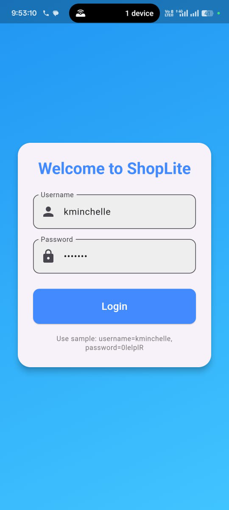
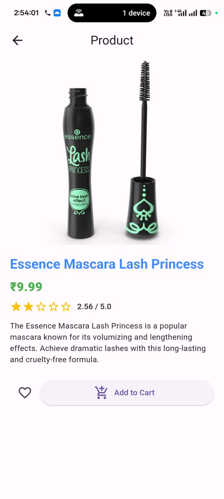
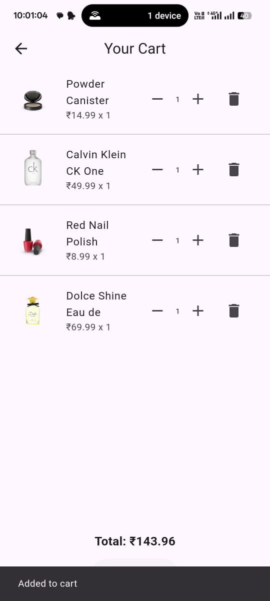

# ShopLite

A compact Flutter e-commerce app that showcases Flutter fundamentals end-to-end: clean architecture, state management, networking, offline cache, testing, CI, and UX polish.

## App Overview & Screenshots
ShopLite is a three-screen shopping application designed to demonstrate a robust Flutter development approach.

*   **Login Screen**: A newly designed, attractive login interface with basic validation. Uses mock authentication with a securely stored token.
*   **Catalog Screen**: Displays a paginated list of products with search and category filtering capabilities. Includes pull-to-refresh and a theme toggle.
*   **Product Detail Screen**: Shows detailed information about a selected product, including an image carousel, price, description, rating, and options to add/remove from favorites and add to cart.
*   **Cart/Checkout (Mock) Screen**: Allows users to view items in their cart, adjust quantities, remove items, and proceed through a mock "Place Order" flow with a summary.

### App Screenshots
| Login | Catalog | Product Detail | Cart |
|-------|---------|----------------|------|
|  |  |  |  |

## Architecture Diagram

ShopLite employs a layered architecture to ensure separation of concerns, maintainability, and testability.

```
+-------------------+     +-------------------+     +-------------------+
|   Presentation    |     |      Domain       |     |        Data       |
| (UI & BLoCs/Cubits)|<--->|   (Repositories)  |<--->|    (APIs & Local)   |
+-------------------+     +-------------------+     +-------------------+
        |                            |                         |
        |                            |                         |
        v                            v                         v
     Widgets                      Interfaces              Dio (Network)
     Screens                                              Hive (Local Cache)
     BLoCs/Cubits                                         FlutterSecureStorage
```

**Layers Breakdown:**
*   **Presentation Layer**: Responsible for rendering the UI and handling user interaction. It consumes data from the Domain layer via BLoCs/Cubits. Screens and UI widgets reside here.
*   **Domain Layer (Repositories)**: Defines the business logic and interfaces for data operations. Repositories act as an abstraction over data sources, providing a clean API to the Presentation layer without exposing implementation details.
*   **Data Layer (APIs & Local Storage)**: Implements the data interfaces defined in the Domain layer. It handles fetching data from remote sources (APIs using `Dio`) and local storage (`Hive` for cache and `FlutterSecureStorage` for tokens). It maps raw data into domain-specific models.

## State Management Choice: BLoC

**Why BLoC?**
BLoC (Business Logic Component) was chosen for ShopLite due to its robust, predictable, and scalable nature, aligning well with the "clean architecture" requirement.

*   **Separation of Concerns**: BLoC effectively separates UI from business logic, making components easier to test and maintain independently.
*   **Predictable State Changes**: All state changes are driven by events, leading to a clear and traceable flow of data and state, which simplifies debugging.
*   **Scalability**: For an e-commerce app with multiple features (catalog, cart, favorites, auth), BLoC's structured approach helps manage complexity as the application grows.
*   **Reactive Programming**: It leverages streams, providing a reactive way to handle asynchronous data flows and UI updates.
*   **Testability**: BLoCs are pure Dart classes, making them highly testable independently of the UI.

## How to Run

### Prerequisites
*   Flutter SDK (3.x+) installed and configured.
*   An Android device/emulator or iOS simulator.

### Steps
1.  **Clone the repository:**
    ```bash
    git clone [YOUR_REPO_URL]
    cd shoplite
    ```
2.  **Install dependencies:**
    ```bash
    flutter pub get
    ```
3.  **Run the app on a connected device/emulator/simulator:**
    ```bash
    flutter run
    ```
    (Replace `flutter run` with `flutter run -d <device_id>` if you have multiple devices and want to specify one.)

### Sample Login Credentials
*   **Username**: `kminchelle`
*   **Password**: `0lelplR`

## How to Run Tests

ShopLite includes unit and widget tests.

1.  **Run all tests:**
    ```bash
    flutter test
    ```
2.  **To generate coverage report (optional):**
    ```bash
    flutter test --coverage
    genhtml coverage/lcov.info --output=coverage/html
    ```
    Then open `coverage/html/index.html` in your browser.

## Caching Strategy & Offline Behavior

ShopLite is designed with an offline-first approach using `Hive` for local data caching.

*   **Data Cached**: Product catalog lists and individual product details are cached.
*   **Persistence**: Cart and Favorites data also persist locally using Hive.
*   **Offline Detection**: The `connectivity_plus` package is used to detect real-time network status.
*   **Offline Banner**: An "You are offline" banner is displayed on the Catalog screen when the device loses network connectivity, indicating that cached data is being served.
*   **Staleness Strategy**: A 30-minute Time-To-Live (TTL) is implemented for cached product data.
    *   When the network is unavailable, the app attempts to load data from the cache.
    *   If cached data exists and is within the 30-minute TTL, it's served.
    *   If cached data is older than 30 minutes (stale), it's invalidated (deleted), and the app will rethrow an exception, effectively treating it as if no cache was found. This ensures users don't see excessively outdated information.

## Known Trade-offs / Limitations
*   **No Server-Side Cart/Favorites**: Cart and favorites data are stored purely locally. This means if the user uninstalls the app, this data will be lost. To persist across uninstalls, a backend API for these features would be required.
*   **Basic Error Handling**: While network and data parsing errors are caught, the user-facing error messages are sometimes generic. More granular error states and user feedback could be implemented.
*   **Mock Authentication**: Authentication is mocked using DummyJSON. In a real-world scenario, a robust authentication service with proper user management would be integrated.
*   **Limited Category Filtering**: The category filter fetches all categories initially. For a very large number of categories, a paginated or searchable category picker might be more efficient.
*   **Minimal Widget Testing**: While basic widget tests exist, more comprehensive UI testing with empty/error states and different screen sizes could be added.
*   **No Dependency Injection Framework**: Dependencies are passed manually. Using a DI framework like `get_it` or `Riverpod` would streamline dependency management.

## CI Status Badge
**(Placeholder for CI Badge - Add your GitHub Actions status badge here)**
e.g., ``

## Build Artifacts
You can find the latest APK here: [app-release.apk](docs/builds/app-release (2).apk)

## App Demo Video
You can watch a demo of the app here: [App Demo Video](docs/videos/app_vdemo_video.mp4)

## Test Coverage Summary
**(Placeholder for test coverage summary or screenshot)**
(Can be a line from the terminal output of `flutter test --coverage` or a screenshot.)
